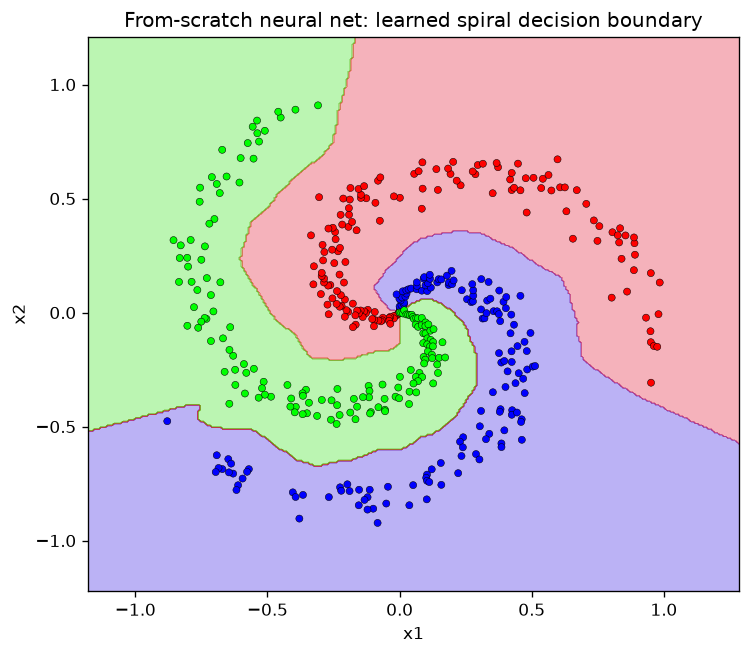

# Neural Network From Scratch (NumPy)

A small, readable deep-learning library built from the ground up in **pure NumPy** -->
no PyTorch, no TensorFlow, no autograd. Layers, activations, losses, optimizers,
and **backpropagation** are all implemented by hand, and the gradients are
**verified correct with numerical gradient checking**.

The goal isn't to compete with frameworks. It's to make the math legible: every
line that makes a network learn is in this repo, commented, and testable.



*A network with two hidden layers, trained by hand-written backprop, bending a
non-linear boundary around three interleaved spiral arms (99.6% accuracy).*

## What makes this more than a toy

- **Backprop from first principles.** The chain rule, layer by layer — not a call to `.backward()`.
- **Gradient checking.** Analytic gradients are compared against central-difference
  numerical gradients; max relative error lands around `1e-8`. This is the difference
  between "seems to train" and "provably correct."
- **Real results, measured.** Numbers below come from actually running the code, not estimates.
- **Clean separation.** A reusable `nn/` library, separate from the demos that use it.

## Quickstart

```bash
pip install -r requirements.txt
python main.py                    # trains on the spiral, saves the plot above
python tests/test_gradients.py    # proves backprop is correct
```

That's it — no dataset downloads, no GPU, no API keys for the core demos.

## Results

| Demo | What it shows | Result |
|---|---|---|
| **Spiral** (`main.py`) | Non-linear classification | **99.6%** train accuracy |
| **Sine** (`examples/regression_sine.py`) | Regression with the same library | MSE ≈ **0.0023** |
| **Gradient check** (`tests/test_gradients.py`) | Backprop correctness | max rel. error ≈ **1e-8** |
| **MNIST** (`examples/train_mnist.py`) | Digit recognition on real data | **97.8%** test accuracy* |

<sub>*Measured: 97.82% final / 98.07% peak over 10 epochs. MNIST downloads ~11 MB
once, then trains CPU-only (~8 min). Every number here is reproducible by running the code.</sub>

## How it works

A feed-forward network here is just a list of layers you walk forward, then
backward. Each layer knows two things:

1. **Forward:** transform its input.
2. **Backward:** turn the gradient of the loss w.r.t. its *output* into the
   gradient w.r.t. its *input* (and its parameters).

For the `Dense` layer, `z = xW + b`, and the chain rule gives the three formulas
that are the entire learning mechanism:

```
dL/dW = xᵀ · (dL/dz)      # how to nudge each weight
dL/db = Σ (dL/dz)          # how to nudge each bias
dL/dx = (dL/dz) · Wᵀ       # gradient handed back to the previous layer
```

Stack those, seed the last layer's gradient from the loss, and learning is just
"apply this backward, then step the optimizer." The [`nn/`](nn/) files spell it
out with comments.

## Project structure

```
nn/
  layers.py        Dense (fully-connected) layer + its backward pass
  activations.py   ReLU, Tanh, Sigmoid (each with a forward/backward)
  losses.py        SoftmaxCrossEntropy, MSE
  optimizers.py    SGD, Momentum, Adam
  network.py       Sequential container that chains layers
  utils.py         accuracy, mini-batching, splits, standardization
data/
  datasets.py      spiral & moons generators (pure NumPy) + MNIST loader
examples/
  train_spiral.py     flagship classification demo + decision-boundary plot
  regression_sine.py  regression demo (fits sin x)
  train_mnist.py      optional real-data benchmark
tests/
  test_gradients.py   numerical gradient checking
main.py               runs the spiral demo
```

## Things to try (make it yours)

The code is meant to be edited. Good next steps, roughly easy → hard:

- **Break it on purpose.** Flip a sign or drop a transpose in `layers.py` and watch
  `test_gradients.py` catch it. Best way to trust the check.
- **Add a new activation** (LeakyReLU, GELU) — implement `forward`/`backward` and
  gradient-check it.
- **Add Dropout or L2 regularization** and see the effect on the spiral boundary.
- **Add a `Conv2D` layer** and rerun MNIST — the jump from dense to conv is the
  natural next milestone.
- **Swap optimizers** (`SGD` vs `Momentum` vs `Adam`) and compare how fast the
  spiral loss drops.

## What this is — and isn't

- **Is:** a correct, legible, hand-derived implementation of a feed-forward net,
  good for learning exactly how backprop works and for extending.
- **Isn't:** production ML. It's CPU-only, has no GPU/autograd, and NumPy loops
  are slow next to a real framework. That's the trade for readability.

## Requirements

- Python 3.9+
- NumPy (required), Matplotlib (for the plots)
